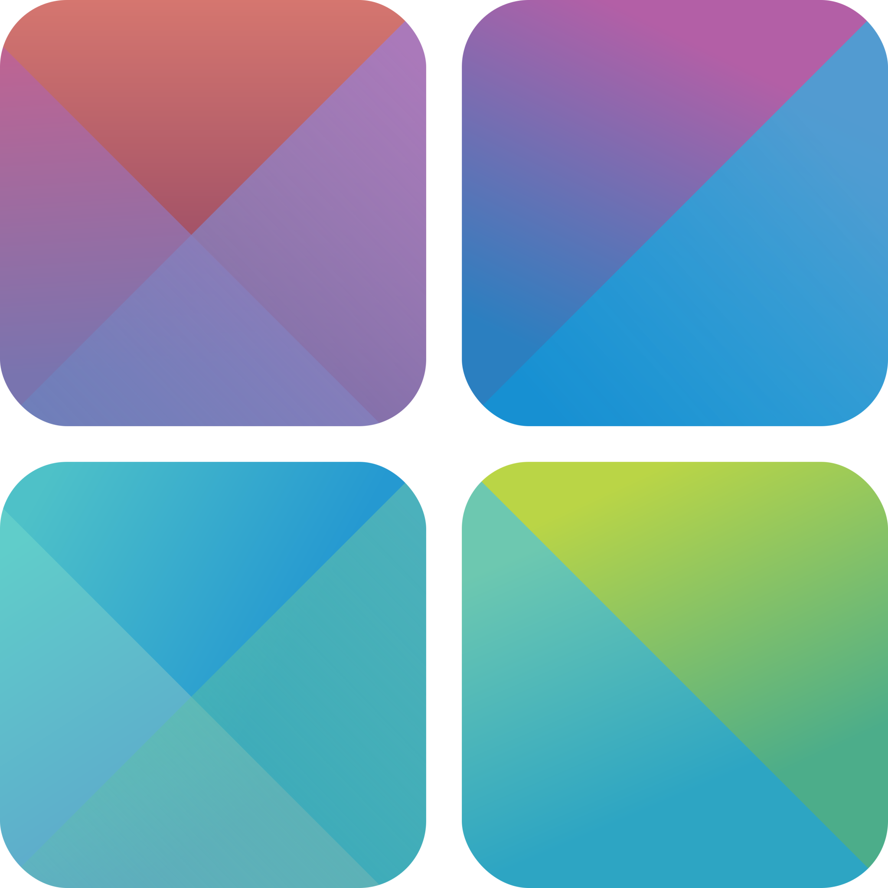
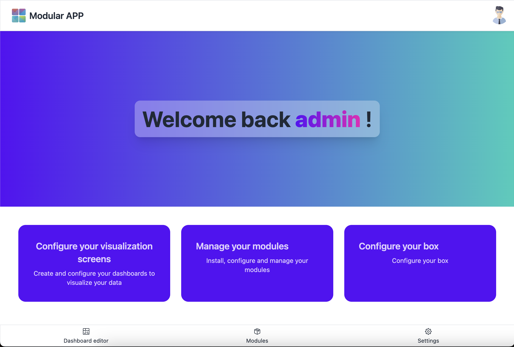

<a name="readme-top"></a>

<br />
<div align="center">
  <a href="https://github.com/nicrausaz/tb-modularapp">
    
  </a>

  <h3 align="center">Modular App</h3>

  <p align="center">
    A modulable services and devices integration application
  </p>

</div>

<!-- ABOUT THE PROJECT -->

## About The Project

<div align="center">

</div>

_Modular App_ is a modular application that allows to create integrations between various devices and services. It is based on a modular architecture that allows to develop new modules and integrate them into the application easily.

It's main goal is to provide a simple way for users to create integrations and to provide a simple way for developers to create new modules.

It's main features are:

- Modules: independent packages that can be imported into the application, enabled and configured by the user.

- Visualisation: creation of dashboard to visualise real-time data from the modules.

- Automation: react to events and trigger actions.

- LAN based & API: provides an UI and a local API that allows integration with other applications and devices within the local network.

This project was developped for my Bachelor Thesis (_TB_) of the Software Engineering Bachelor of Science at [HEIG-VD](https://heig-vd.ch) in 2023.

<p align="right">(<a href="#readme-top">back to top</a>)</p>

### Built With

This section should list any major frameworks/libraries used to bootstrap your project. Leave any add-ons/plugins for the acknowledgements section. Here are a few examples.

- [![React][React.js]][React-url]
- [![Node][Node]][Node-url]
- [![Docker][Docker]][Docker-url]
- [![TypeScript][TypeScript]][TypeScript-url]

<p align="right">(<a href="#readme-top">back to top</a>)</p>

<!-- GETTING STARTED -->

## Getting Started

This is an example of how you may give instructions on setting up your project locally.
To get a local copy up and running follow these simple example steps.

### Prerequisites

This is an example of how to list things you need to use the software and how to install them.

- [Node.js](https://nodejs.org/) (v. >= 18.16.0 recommended)

- [Docker](https://www.docker.com/) (optionnal)

### Installation

_Below are a few examples and usefull monorepo commands to get you started with the application._

1. Clone the repo

2. Install NPM packages

   ```sh
   npm install
   ```

3. Build the application

   ```sh
   npm run build -W
   ```

4. Copy and fill the .env file

   ```sh
   cp ./packages/server/.env.example ./packages/server/.env
   ```

   ```env
    JWT_SECRET = <generate a random string>
    PORT = 3000
    ENV = development
    DB_DIR = <path_to>/tb-modularapp/packages/server/src/database
    MODULES_DIR = <path_to>/tb-modularapp/packages/server/modules
    PUBLIC_DIR = <path_to>/tb-modularapp/packages/server/public
   ```

5. Start the backend

   ```sh
   npm run start -w packages/server
   ```

6. Start the frontend
   ```sh
    npm run dev -w packages/frontend
   ```

<p align="right">(<a href="#readme-top">back to top</a>)</p>

<!-- CONTACT -->

## Contact

Nicolas Crausaz - [Website](https://crausaz.click/)

<p align="right">(<a href="#readme-top">back to top</a>)</p>

<!-- ACKNOWLEDGMENTS -->

## Acknowledgments

Check out these projects that helped me build this application:

- [TailwindCSS](https://tailwindcss.com/)
- [DaisyUI](https://daisyui.com/)
- [React Grid Layout](https://github.com/react-grid-layout/react-grid-layout)

<p align="right">(<a href="#readme-top">back to top</a>)</p>

[React.js]: https://img.shields.io/badge/React-20232A?style=for-the-badge&logo=react&logoColor=61DAFB
[React-url]: https://reactjs.org/
[Node]: https://img.shields.io/badge/Node.js-43853D?style=for-the-badge&logo=node.js&logoColor=white
[Node-url]: https://nodejs.org/
[Docker]: https://img.shields.io/badge/Docker-003f8c?style=for-the-badge&logo=docker
[Docker-url]: https://www.docker.com/
[TypeScript]: https://img.shields.io/badge/TypeScript-007ACC?style=for-the-badge&logo=typescript&logoColor=white
[TypeScript-url]: https://www.typescriptlang.org/
